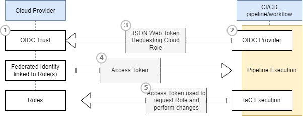

## Introduction

This Repo contains examples of how to configure Cloud Providers and cloud CI/CD platforms (Circleci and GitHub Actions) to authenticate with OpenID Connect (OIDC)

Completed so far:

- Creation of OIDC identities for Azure for Circleci and Github Actions.
- Sample Terraform execution in workflows for Circleci and Github Actions
- Dockerfile for a a container of tools used by rackspace in customer pipelines (to show integration of OIDC into both "native" execution on the CI/CD pipelines and custom docker container based executions)

TODO:

- much!

### What is OpenID Connect (OIDC) and why should I use this?

OpenID Connect allows your workflows/pipelines to exchange short-lived tokens directly from your cloud provider. This guide pulls together information from various sources to try and provide a single technical resource to help you implement OIDC in your code pipelines. 

Credit for content below goes mainly to [GitHub Docs](https://docs.github.com/en/actions/deployment/security-hardening-your-deployments/about-security-hardening-with-openid-connect )

### Overview of OpenID Connect.

Cloud based CI/CD platforms are often designed to access a cloud provider (such as AWS, Azure, GCP, or HashiCorp Vault) in order to deploy software or use the cloud's services. Examples of popular CI/CD platforms include CircleCI, Github Actions and Azure DevOps. Rackspace commonly uses CircleCI to perform Infrastructure as Code (IaC) pipeline operations on customer environments.

Before the IaC can access these resources, it  needs to supply credentials, such as a password or token, to the cloud provider. These cloud provider credentials are often stored as a secret in within the pipeline and accessed every time it runs.

However, using hardcoded secrets requires you to create credentials in the cloud provider and then duplicate them in the CI/CD platform as a secret.
With OpenID Connect (OIDC), you can take a different approach by configuring your pipeline to request a short-lived access token directly from the cloud provider. Your cloud provider also needs to support OIDC on their end, and you must configure a trust relationship that controls which identities are able to request the access tokens. Providers that currently support OIDC include Amazon Web Services, Azure, Google Cloud Platform, and HashiCorp Vault, among others.

### Benefits of using OIDC

By updating your pipelines to use OIDC tokens, you can adopt the following good security practices:

•	No cloud secrets: You won't need to duplicate your cloud credentials as long-lived secrets. Instead, you can configure the OIDC trust on your cloud provider, and then update your workflows to request a short-lived access token from the cloud provider through OIDC.

•	Authentication and authorization management: You have more granular control over how workflows can use credentials, using your cloud provider's authentication (authN) and authorization (authZ) tools to control access to cloud resources.

•	Rotating credentials: With OIDC, your cloud provider issues a short-lived access token that is only valid for a single job, and then automatically expires.
 
## Getting started with OIDC
The following diagram gives an overview of how CI/CD OIDC provider integrates with your workflows and cloud provider:

 
1. In your cloud provider, create an OIDC trust between your cloud role and your CI/CD provider identities that need access to the cloud.

2. Every time your job runs, CI/CD platform OIDC Provider auto-generates an OIDC token. This token contains multiple claims to establish a security-hardened and verifiable identity about the specific workflow/pipeline/project that is trying to authenticate.

3.	You could include a step or action in your job to request this token from OIDC provider and present it to the cloud provider (terraform performs this step automatically for some cloud providers).

4.	Once the cloud provider successfully validates the claims presented in the token, it then provides a short-lived cloud access token that is available only for the duration of the job.

5.	The IaC code execution presents the access token back to the cloud provider to request resource changes,
 

## Useful References:

Circleci (covers project settings and GCP/AWS) : https://circleci.com/docs/openid-connect-tokens

Github Actions (sections on AWS/GCP and Azure): https://docs.github.com/en/actions/deployment/security-hardening-your-deployments/about-security-hardening-with-openid-connect

Azure and Github Actions, useful walk through: https://www.cloudwithchris.com/blog/using-oidc-github-actions-azure-swa/

Azure and Github actions MS guid: https://learn.microsoft.com/en-us/azure/developer/github/connect-from-azure?tabs=azure-portal%2Clinux

Circleci and GCP: https://harryhodge.co.uk/posts/2022/07/keyless-authentication-from-circleci-to-google-cloud/ 

