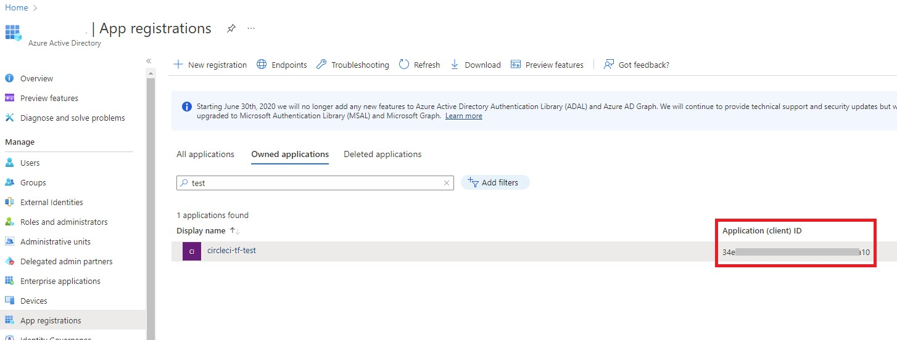
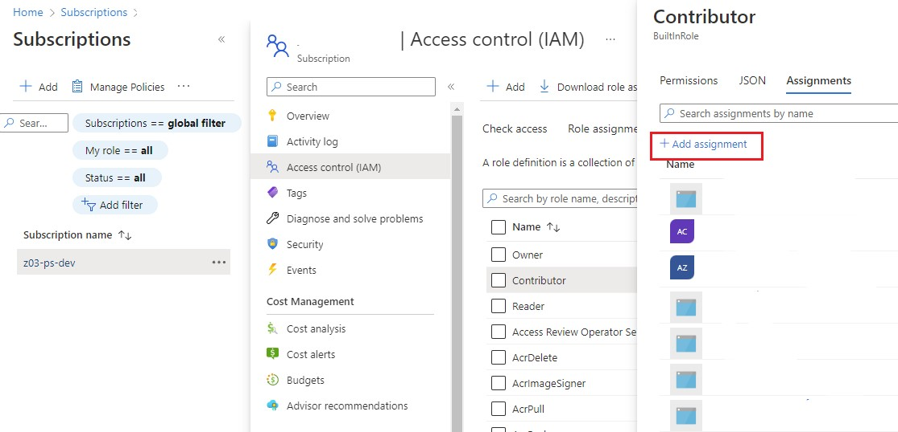
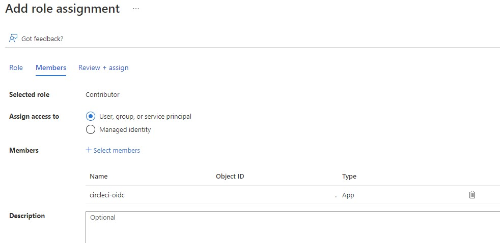
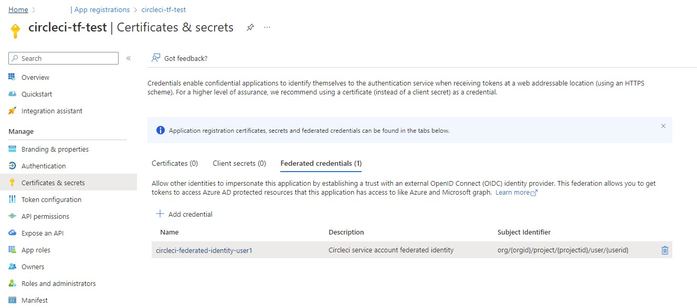
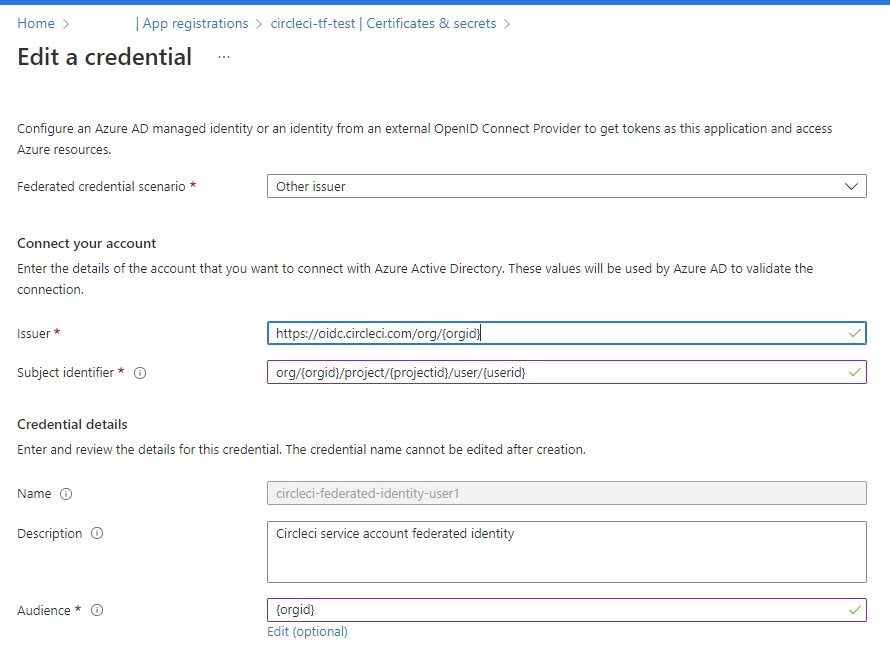
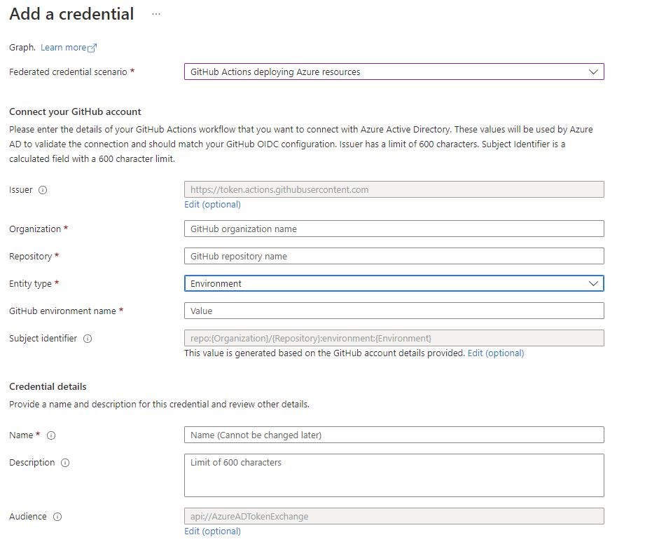

# Configuring the OIDC trust with the cloud

The cloud OIDC trust configuration is unique to each cloud provider and each CI/CD platform, the key elements of the cloud providers configuration:

## Azure App registrations

Azure OIDC authentication is defined with “Azure Active Directory” “App registrations”.

An application needs to be created, and associated with a service principle, with the required roles in the subscription. The Application (client) ID highlighted below in red is important and needs to be provided to the CI/CD platform.

Once the application is created, navigate to a resource (for example a subscription) and use “Add assignment” to grant the application access rights.

Examples of the terraform and az cli required to configure an application and the service principle are included in this repository.

These create an application, with one or more federated credentials:

### Application Federated Credentials: 

### Circle CI example credential:

### Github Actions example credential:

