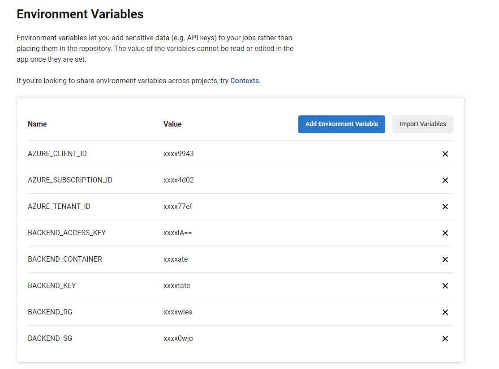
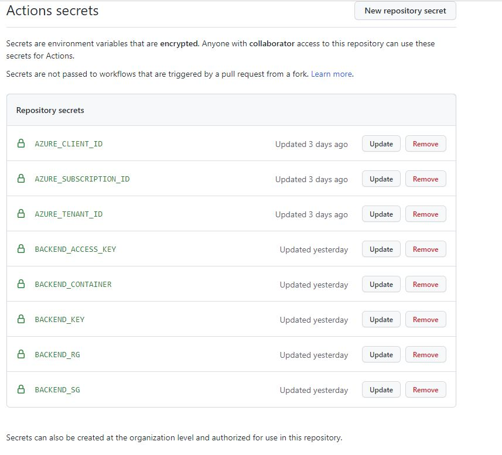

# Pipeline Examples

Structure

- .circleci     - example circleci workflows
- .github       - example github actrion workflows
- docker        - example dockerfile for rackspace tooling container used to execute python terraform wrapper.
- images        - screen shots used in this readme
- layers/       - example terraform that can be executed by the circleci or github workflows to create a test resource an confirm OIDC is working.

Assumes the cloud-provider-setup has been completed.

## Azure - CircleCI


| CIRCLECI/TERRAFORM OIDC SUPPORT: Terraform Azure backend does not support “generic oidc”, it only supports oidc on github actions, so a "storage access key" needs to be used to connect to a state container. Terraform limitations for Azure are annoying but may be resolved by the time you read this paper, open issue that should resolve it https://github.com/hashicorp/terraform/issues/31802 |
| --- |


CircleCI workflows must be configured with a context to enable OIDC. See detail here : https://circleci.com/docs/openid-connect-tokens 

Steps to enable OIDC in CircleCI

  1.    Create an application ID in Azure (see notes [here](../../cloud-provider-setup/azure/circleci/README.md) )
  2.    Define a context in your circleci organisation (https://circleci.com/docs/openid-connect-tokens)
  3.    Define project level environment variables (see list below, note "Application ID" comes from Azure when you create an application registration)
  4.    Define a workflow with the context enabled

```
workflows:
  my-workflow:
    jobs:
      - run-tests:
          context:
            - my-context
```

  5.   Use the environment variable CIRCLECI_OIDC_TOKEN to access the token for Terraform and AZ cli.


### Example workflows

- config-orb.yml - uses native circle ci orbs to create an environment with terraform
- config-docker.yml - uses a docker image with rackspace pipeline tools added and a python script to execute the terraform in the layers/ directory structure
  - Note: this uses a container: codeinavan/pipeline-toolbox-tf:latest created using the Dockerfile [here](docker/Dockerfile).
  - Also note example has a context name defined, this needs to be updated to reflect your environment.

Requires the project variables to be created as shown:

```
AZURE_CLIENT_ID - the appid created in Azure AD (see "cloud-provider-setup")

AZURE_TENANT_ID
AZURE_SUBSCRIPTION_ID

BACKEND_ACCESS_KEY - access key from Azure storage group, needed until terraform backend supports OIDC (see issue https://github.com/hashicorp/terraform/issues/31802 )

BACKEND_RG - Resource group of backend
BACKEND_SG - Storage group of backend     
BACKEND_CONTAINER - Container name of backend container e.g. tfstate
BACKEND_KEY - State Key e.g. terraform.tfstate

```



## Azure Github Actions

GitHub Actions is easier to integrate with Azure and has better support from Terraform for OIDC, there is specific OIDC code baked into Terraform so there is no need extra tokens to provide your code.

GitHub workflows must be configured with an id-token permission (see detail here) to enable OIDC. 

Steps to enable OIDC in GitHub Actions:
1.	Create an application ID in Azure (see notes above )
2.	Define repository level secrets (see list below, note "Application ID" comes from Azure when you create an application registration)

- AZURE_CLIENT_ID - the AppID created in Azure AD (see "cloud-provider-setup")
- AZURE_TENANT_ID
- AZURE_SUBSCRIPTION_ID
- BACKEND_RG - Resource group of backend
- BACKEND_SG - Storage group of backend     
- BACKEND_CONTAINER - Container name of backend container e.g. tfstate
- BACKEND_KEY - State Key e.g. terraform.tfstate

3.	Set permissions within a workflow to allow token access


See example workflows in this repo for a full pipeline using the above technique and also for execution using a Docker container to execute a python based Terraform wrapper.


### Example workflows

- 1_tfplan-az-cli.yml           - Authenticates with OIDC and runs just az cli test
- 2_tfplan-tf-oidc.yml          - Authenticates with OIDC and runs terraform plan from hashicorp/setup-terraform@v1 
- 3_tfplan_tf-docker_python.yml - Uses a rackspace tooling docker container, runs terraform using python scripts (using OIDC auth)

Requires the repo secrets to be created as shown:

```
AZURE_CLIENT_ID - the appid created in Azure AD (see "cloud-provider-setup")

AZURE_TENANT_ID
AZURE_SUBSCRIPTION_ID

BACKEND_ACCESS_KEY - IS NOT REQUIRED IN GITHUB ACTIONS

BACKEND_RG - Resouce group of backend
BACKEND_SG - Storage group of backend     
BACKEND_CONTAINER - Container name of backend container e.g. tfstate
BACKEND_KEY - State Key e.g. terraform.tfstate

```


## Useful references

Circleci (covers project settings and GCP/AWS) : https://circleci.com/docs/openid-connect-tokens

Github Actions (sections on AWS/GCP and Azure): https://docs.github.com/en/actions/deployment/security-hardening-your-deployments/about-security-hardening-with-openid-connect

Azure and Github Actions, useful walk through: https://www.cloudwithchris.com/blog/using-oidc-github-actions-azure-swa/

Azure and Github actions MS guid: https://learn.microsoft.com/en-us/azure/developer/github/connect-from-azure?tabs=azure-portal%2Clinux

Circleci and GCP: https://harryhodge.co.uk/posts/2022/07/keyless-authentication-from-circleci-to-google-cloud/

