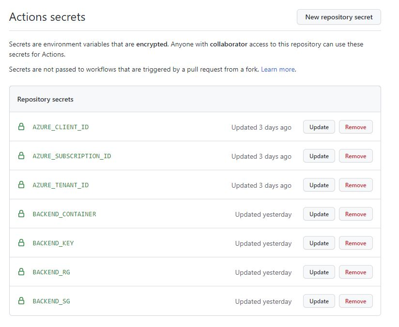

# Pipeline Examples

## Azure - CircleCI

Circle CI Example workflows:

config-orb.yml - uses native circle ci orbs to create an environment with terraform

config-docker.yml - uses a docker image with rackspace pipeline tools added and a python script to execute the terraform in the layers/ directory structure

Requires the project variables to be created as shown:

<a>
    
</a>

```
AZURE_CLIENT_ID - teh appid created in Azure AD (see "cloud-provider-setup")

AZURE_TENANT_ID
AZURE_SUBSCRIPTION_ID

BACKEND_ACCESS_KEY - access key from Azure storage group, needed until terraform backend supports OIDC (see issue https://github.com/hashicorp/terraform/issues/31802 )

BACKEND_RG - Resouce group of backend
BACKEND_SG - Storage group of backend     
BACKEND_CONTAINER - Container name of backend container e.g. tfstate
BACKEND_KEY - State Key e.g. terraform.tfstate

```
## Azure Github Actions

Requires the repo secrets to be created as shown:

```
AZURE_CLIENT_ID - teh appid created in Azure AD (see "cloud-provider-setup")

AZURE_TENANT_ID
AZURE_SUBSCRIPTION_ID

BACKEND_ACCESS_KEY - IS NOT REQUIRED IN GITHUB ACTIONS

BACKEND_RG - Resouce group of backend
BACKEND_SG - Storage group of backend     
BACKEND_CONTAINER - Container name of backend container e.g. tfstate
BACKEND_KEY - State Key e.g. terraform.tfstate

```

<a>
    
</a>

