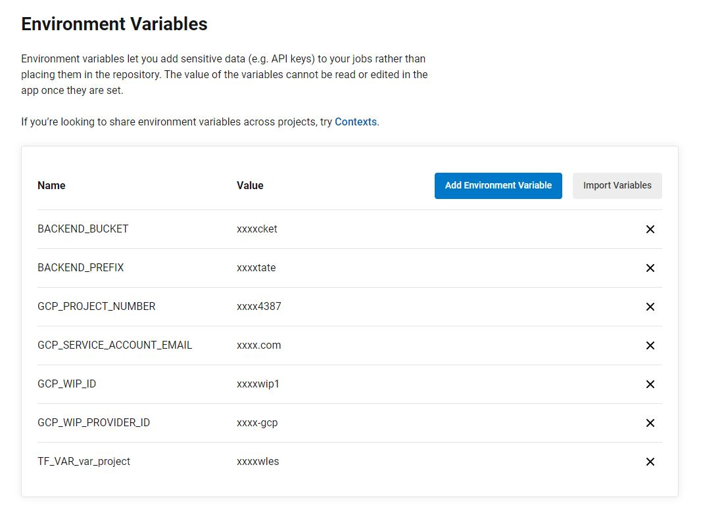

# Pipeline Examples

Structure

- .circleci     - example circleci workflows

- docker        - example dockerfile for rackspace tooling container used to execute python terraform wrapper.
- images        - screen shots used in this readme
- layers/       - example terraform that can be executed by the circleci or github workflows to read a test resource an confirm OIDC is working.

Assumes the cloud-provider-setup has been completed.

## GCP - CircleCI

Testing OIDC auth between CircleCI and GCP

Environment vars required for circle-ci
```
GCP_PROJECT_NUMBER = target project number! e.g. 1234567890
GCP_WIP_ID = Workload Identity Fed Pool ID e.g.  "circleci-oidc"
GCP_WIP_PROVIDER_ID = Workload Identity Fed Pool Provider ID e.g. "circleci-org-name"
GCP_SERVICE_ACCOUNT_EMAIL = GCP service account to impresonate e.g. coen-matt-circleci-sa@coen-matthew-rawles.iam.gserviceaccount.com

BACKEND_BUCKET = GCP cloud storage bucket used to store the state
BACKEND_PREFIX = terraform state prefix (key) for the state 

TF_VAR_var_project = gcp project id e.g. my-gcp-project
```



